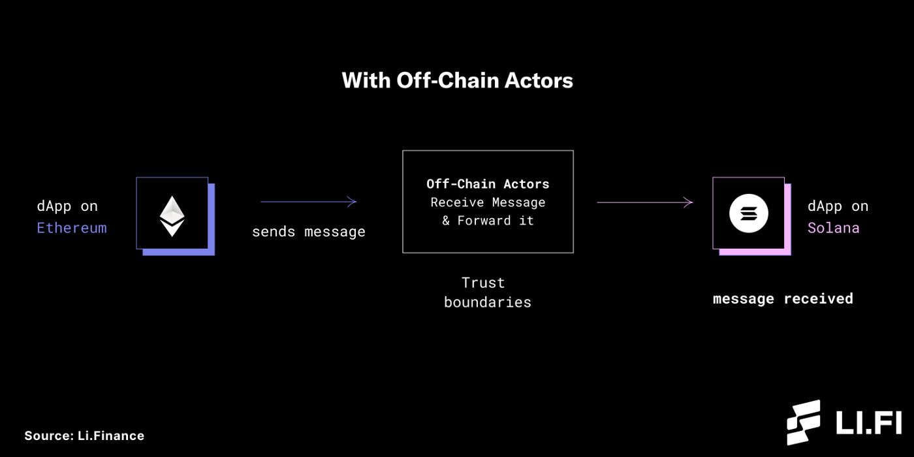

<<<<<<< HEAD
# In the Post-Merge World, What It Will Take To Bridge Blockchain To Transfer Your Money?

Author: [Evta](https://twitter.com/pwhattie)

The historic Merge is done and as the drastic increase in the number and size of different blockchain ecosystems, currently 118 public chains according to Blockchain Comparison, there is now more than ever a need for key infrastructure to connect them. Blockchains can only send messages in one direction and have no idea what’s happening off-chain. It’s likely, following The Merge, that Ethereum will play a larger role in the future of blockchain bridges.

## Cross-chain ≠ Cross-chain Bridge

At their core, blockchain/crosschain bridges could be defined as an interoperability system that transfers information, like assets, contract calls, proofs or state, between two or more blockchains. It should be noted that cross-chain, mainly transferring data and assets, is not equal to cross-chain bridge, as many people confuse the relationship between Polkadot, Cosmos and cross-chain bridge. Simply speaking, Polkadot is more like Layer 0 that users need to implement cross-chain based on their own standards, while for cross-chain bridges, they can have different protocols to transfer different assets. At present, the two approaches are also classified as cross-chain bridges in some places, but considering that (1) it is difficult to implement heterogeneous information cross-chain; (2) asset cross-chain is a hot topic, sufficient to meet current needs, this article mainly discusses asset cross-chain bridges.

Why Are There So Many Different Bridges? Bridge designs vary according to security, speed, connectivity, capital efficiency and statefulness (any kind of data), according to Dmitriy Berenzon. However, there is no one way or generalized solutions forof enabling communication between blockchains, because of interoperability trilemma that all bridges have to choose between — trustlessness (security equal to domain), extensibility (supported on any domain) or generalizability (handling arbitrary cross-domain data).

Hence bridges have different designs with unique strengths and trade-offs, especially a lot of options between speed and security, based on their functionality of what they connect and their main uses. Except generalized bridges for multiple blockchain, there are roughly four types according to Dmitriy Berenzon: Asset-specific (most are “wrapped” asset fully collateralized by custodial or non-custodial underlying like wBTC), Data Specific (transferring arbitrary data as the base layer for dApps like Celer’s inter-chain Message Framework, IBC, Nomad, and Data Movr), Application-specific (lighter, modular “adapters” on more blockchains but solely for use within that application like Compound Chain), as well as Chain-specific (limited to two chains like Polygon).

## How to Work: Information Validation & Money Transfer?

There are several components to most bridge designs, but we would like to divide the operation into two core parts:
(1) Monitoring information by validators (relayer/light-client or oracle) under consensus signing individually or multisig
; (2) Asset transferring/Relaying from the source chain to the destination chain. In a sense, the cross-chain bridge is developing along the optimization of both two under decentralization: wide coverage of validators or universal and fast money transferring.

According to Celia Wan, centralized exchanges (CEXs) were the commonly used bridges in the early days, which may be acceptable if staking their reputation on operation. Otherwise, they could be regarded as the least secure bridges to issue more wrapped tokens than its accrual holding, which could not be verified by the community. To solve this problem, Some assets are locked on Ethereum as a “proof of reserves” by Binance. Also a somewhat centralized bridge, adopted by only a few projects like Chainswap (Solana) and Chainsafe (Avalanche), would have a group of whitelisted relayers, usually KYCed and mutually trusted in real life.

Most, however, have plans to further decentralize their bridges using different mechanisms of verifiers in how bridges work and whether the relay network is permissioness. In other words, bridges can generally be classified into Trusted and Trustless ones. Some bridges are built on a POS network that allows anyone to be a validator incentivized to run nodes relaying correct information in exchange for transaction fees or their stake will be slashed, so that users need to give up control of their assets to trust a third party to hold their funds. A few others that feature completely trustless relayers still need to pass information from one chain to another, but remove the role of the trusted third party for information accuracy and enable users to remain in control of their assets with security equal to that of the underlying blockchains, like connext, Hop, ETH Optimistic Rollup Arbitrum and BOBA, and other bridges with a simple atomic swap mechanism. Among them, Insured bridges ensure that users will be reimbursed through slashed collateral from malicious actors, which are safer than Bonded bridges in which users do not recover funds because the slashed collateral is likely burned. Hence, security could roughly be used to rank them from higher to lower: Trust-less > Insured > Bonded > Trusted.

Zooming in, Arjun Bhuptani and Dmitriy Berenzon classify bridges based on how they are verified into natively, externally, and locally verified systems (liquidity networks). External validators & Federations are statefulness and connectivity but come at the cost of security and capital efficient for collateral, because they monitor a “mailbox” address and rely the bridge, or oracle price feed, rather than the source or destination chains to mint and burn wrapped tokens via multisig or multi-party computation (MPC). MPC is greater in security which requires verifiers to jointly form a private key to complete transaction, compared to multisig requiring each verifiers to have a complete private key, according to Alice Klocko. Light clients & Relays generate cryptographic inclusion proofs about events monitored on the source chain, along with the block headers, to contracts on the destination chain in header relay systems. They are both strong with statefulness and security safe as the most capital-efficient bridges for trustless valid delivery, but at the cost of resource-intensive and expensive connectivity to require full SPV verification or build a new smart contract on each destination chain between O(LogN) and O(N) complexity. Liquidity networks, a peer-to-peer network where each node acts as a “router” that holds an “inventory” of assets of both the source and destination chain, like Connext, are likely a safer, faster and more capital efficient option for users who are transferring large amounts of value, because they are locally verified systems or do not require global consensus, tied to transaction flow/volume rather than security. The trade-off is statefulness because they are limited in functionality. There are also hybrid models like Gravity, Interlay, and tBTC, having light clients in one direction and validators in another.

Although bridge-building looks like a technical issue, it’s also to a great degree an economics issue that a project with a token on a single chain needs to decide whether they want to inflate their total token supply like USDT, or to map asset locking an equal amount to maintain the fixed supply like SUSHI and 1INCH. Generally, based on how they transfer assets, bridges fall into the Lock& Mint, Burn& Mint and Atomic Swaps by Arjun Chand, as well as Balance float, Mint/Burn, Liquidity swap and Wrapped + Mint/Burn by Andre Cronje. We would like to divide them into three types: Lock/Burn & Mint, Liquidity Swap, and Atomic Swaps. Lock/Burn & Mint bridges mint identical Wrapped assets after locking assets on the source chain on a chain-to chain basis like Polygon’s PoS bridge, Avalanche Bridge, wrapped BTC, and wMonero, or after burning or destroying assets on the source chain like Hop and Across. Liquidity Swap sounds like Lock/Burn & Mint, but demands a liquidity pool to do so. Atomic Swaps bridges, used by the liquidity network generally as the most trustless security among the three, swap assets on self-executing smart contracts and remove the requirement for a trusted third-party on a peer-to-peer basis, like Anyswap V3, Shuttle Flow and Debridge, cBridge, and Connext. But there are also drawbacks that both two bridges must have a cooperative homologous computing method to be verified on both chains. According to Andre Cronje, Wrapped + Mint/Burn (the combination of Lock/Burn & Mint and liquidity pool) is the best technical solution to transfer money if the token in the target chain is mint as universal as USDT, and liquidity pool is not required to build.

## Rethinking Risk for the Future

A cross-chain bridge undoubtedly has many benefits, but also has downsides that may include theft, failure to work properly, and hacking. Also liquidity is very fragmented via Lock & Mint/Burn in most bridges, which confuses users by what their various names actually represent, like ceUSDC、anyUSDC、madUSDC and USDC.e. Furthermore, a few of these bridges, holding large amounts of both tokens enticing to hackers, are simply not safe enough for users to entrust their funds, as Chainalysis estimates that $2 billion worth of has been stolen across 13 separate cross-chain bridge hacks, accounting for 69% of total funds stolen in 2022 so far.

Some hacks are general in various projects, like Anyswap in which the hacker discovered loopholes and obtains the public and private key pairs to steal the assets. Most hacks, like Chainswap that the hacker invoked the mint function of the project's original token to directly print money, are related to the selection of cross-chain solutions, as there is no perfect solution:

Locked in liquidity → Fragmentation, friction and cost
Liquidity pool → Huge attack exposure and capital inefficiencies
Wrapped assets → Systemic financial risk
Off-chain Relayers → Theft of user funds, malicious exploits, monopolies, and censorship

## In Post-Merge World What Will Bridges Look Like?

Each bridge has its own strengths and weaknesses. Its development may revolve around the "Impossible Triangle of Interoperability", or it may be optimized based on security, speed, scalability, capital efficiency, and statefulness.

Whether there will be EVM vs. non-EVM compatible public chains in the future also deserves further discussion, like Apple vs Microsoft, Android vs iOS, Chrome vs Firefox. As Ethereum takes away the market share from other EVM chains, bridges between Ethereum and other non-EVM chains will start to play a pivotal role, like Solana and Near, in the post-Merge world.

Also, while bridge usage focuses on leveraging the limitless potential of blockchain technology, aggregators like Li Finance could benefit both developers and end-users by building the best abstraction and aggregation solution available on the market.

Naturally, we may be inching toward an inevitable Web3 of multi-chain interoperability, but before using, both users and developers must evaluate their security of any bridge before using it.

## Reference

- Multichain dapp guide, standards, and best practices
- What Are Blockchain Bridges And How Can We Classify Them?
- What Are Cross-Chain Bridges?
- Blockchain Bridges: Building Networks of Cryptonetworks
- Bridges in Crypto-Space
- The Interoperability Trilemma
- Secure The Bridge: Cross-Chain Communication Done Right
- Vulnerabilities in Cross-chain Bridge Protocols Emerge as Top Security Risk
- What Are Blockchain Bridges and How Do They Work?
- Multisig V.S. MPC in Blockchain Signature
||||||| 089d707
=======
# In the Post-Merge World, What It Will Take To Bridge Blockchain To Transfer Your Money?

Author: [Eta](https://twitter.com/pwhattie)

The historic Merge is done and as the drastic increase in the number and size of different blockchain ecosystems, currently 118 public chains according to Blockchain Comparison, there is now more than ever a need for key infrastructure to connect them. Blockchains can only send messages in one direction and have no idea what’s happening off-chain. It’s likely, following The Merge, that Ethereum will play a larger role in the future of blockchain bridges.

## Cross-chain ≠ Cross-chain Bridge

At their core, blockchain/crosschain bridges could be defined as an interoperability system that transfers information, like assets, contract calls, proofs or state, between two or more blockchains. It should be noted that cross-chain, mainly transferring data and assets, is not equal to cross-chain bridge, as many people confuse the relationship between Polkadot, Cosmos and cross-chain bridge. Simply speaking, Polkadot is more like Layer 0 that users need to implement cross-chain based on their own standards, while for cross-chain bridges, they can have different protocols to transfer different assets. At present, the two approaches are also classified as cross-chain bridges in some places, but considering that (1) it is difficult to implement heterogeneous information cross-chain; (2) asset cross-chain is a hot topic, sufficient to meet current needs, this article mainly discusses asset cross-chain bridges.

Why Are There So Many Different Bridges? Bridge designs vary according to security, speed, connectivity, capital efficiency and statefulness (any kind of data), according to Dmitriy Berenzon. However, there is no one way or generalized solutions forof enabling communication between blockchains, because of interoperability trilemma that all bridges have to choose between — trustlessness (security equal to domain), extensibility (supported on any domain) or generalizability (handling arbitrary cross-domain data).

Hence bridges have different designs with unique strengths and trade-offs, especially a lot of options between speed and security, based on their functionality of what they connect and their main uses. Except generalized bridges for multiple blockchain, there are roughly four types according to Dmitriy Berenzon: Asset-specific (most are “wrapped” asset fully collateralized by custodial or non-custodial underlying like wBTC), Data Specific (transferring arbitrary data as the base layer for dApps like Celer’s inter-chain Message Framework, IBC, Nomad, and Data Movr), Application-specific (lighter, modular “adapters” on more blockchains but solely for use within that application like Compound Chain), as well as Chain-specific (limited to two chains like Polygon).

## How to Work: Information Validation & Money Transfer?

There are several components to most bridge designs, but we would like to divide the operation into two core parts:
(1) Monitoring information by validators (relayer/light-client or oracle) under consensus signing individually or multisig
; (2) Asset transferring/Relaying from the source chain to the destination chain. In a sense, the cross-chain bridge is developing along the optimization of both two under decentralization: wide coverage of validators or universal and fast money transferring.

According to Celia Wan, centralized exchanges (CEXs) were the commonly used bridges in the early days, which may be acceptable if staking their reputation on operation. Otherwise, they could be regarded as the least secure bridges to issue more wrapped tokens than its accrual holding, which could not be verified by the community. To solve this problem, Some assets are locked on Ethereum as a “proof of reserves” by Binance. Also a somewhat centralized bridge, adopted by only a few projects like Chainswap (Solana) and Chainsafe (Avalanche), would have a group of whitelisted relayers, usually KYCed and mutually trusted in real life.

Most, however, have plans to further decentralize their bridges using different mechanisms of verifiers in how bridges work and whether the relay network is permissioness. In other words, bridges can generally be classified into Trusted and Trustless ones. Some bridges are built on a POS network that allows anyone to be a validator incentivized to run nodes relaying correct information in exchange for transaction fees or their stake will be slashed, so that users need to give up control of their assets to trust a third party to hold their funds. A few others that feature completely trustless relayers still need to pass information from one chain to another, but remove the role of the trusted third party for information accuracy and enable users to remain in control of their assets with security equal to that of the underlying blockchains, like connext, Hop, ETH Optimistic Rollup Arbitrum and BOBA, and other bridges with a simple atomic swap mechanism. Among them, Insured bridges ensure that users will be reimbursed through slashed collateral from malicious actors, which are safer than Bonded bridges in which users do not recover funds because the slashed collateral is likely burned. Hence, security could roughly be used to rank them from higher to lower: Trust-less > Insured > Bonded > Trusted.

Zooming in, Arjun Bhuptani and Dmitriy Berenzon classify bridges based on how they are verified into natively, externally, and locally verified systems (liquidity networks). External validators & Federations are statefulness and connectivity but come at the cost of security and capital efficient for collateral, because they monitor a “mailbox” address and rely the bridge, or oracle price feed, rather than the source or destination chains to mint and burn wrapped tokens via multisig or multi-party computation (MPC). MPC is greater in security which requires verifiers to jointly form a private key to complete transaction, compared to multisig requiring each verifiers to have a complete private key, according to Alice Klocko. Light clients & Relays generate cryptographic inclusion proofs about events monitored on the source chain, along with the block headers, to contracts on the destination chain in header relay systems. They are both strong with statefulness and security safe as the most capital-efficient bridges for trustless valid delivery, but at the cost of resource-intensive and expensive connectivity to require full SPV verification or build a new smart contract on each destination chain between O(LogN) and O(N) complexity. Liquidity networks, a peer-to-peer network where each node acts as a “router” that holds an “inventory” of assets of both the source and destination chain, like Connext, are likely a safer, faster and more capital efficient option for users who are transferring large amounts of value, because they are locally verified systems or do not require global consensus, tied to transaction flow/volume rather than security. The trade-off is statefulness because they are limited in functionality. There are also hybrid models like Gravity, Interlay, and tBTC, having light clients in one direction and validators in another.

Although bridge-building looks like a technical issue, it’s also to a great degree an economics issue that a project with a token on a single chain needs to decide whether they want to inflate their total token supply like USDT, or to map asset locking an equal amount to maintain the fixed supply like SUSHI and 1INCH. Generally, based on how they transfer assets, bridges fall into the Lock& Mint, Burn& Mint and Atomic Swaps by Arjun Chand, as well as Balance float, Mint/Burn, Liquidity swap and Wrapped + Mint/Burn by Andre Cronje. We would like to divide them into three types: Lock/Burn & Mint, Liquidity Swap, and Atomic Swaps. Lock/Burn & Mint bridges mint identical Wrapped assets after locking assets on the source chain on a chain-to chain basis like Polygon’s PoS bridge, Avalanche Bridge, wrapped BTC, and wMonero, or after burning or destroying assets on the source chain like Hop and Across. Liquidity Swap sounds like Lock/Burn & Mint, but demands a liquidity pool to do so. Atomic Swaps bridges, used by the liquidity network generally as the most trustless security among the three, swap assets on self-executing smart contracts and remove the requirement for a trusted third-party on a peer-to-peer basis, like Anyswap V3, Shuttle Flow and Debridge, cBridge, and Connext. But there are also drawbacks that both two bridges must have a cooperative homologous computing method to be verified on both chains. According to Andre Cronje, Wrapped + Mint/Burn (the combination of Lock/Burn & Mint and liquidity pool) is the best technical solution to transfer money if the token in the target chain is mint as universal as USDT, and liquidity pool is not required to build.

## Rethinking Risk for the Future

A cross-chain bridge undoubtedly has many benefits, but also has downsides that may include theft, failure to work properly, and hacking. Also liquidity is very fragmented via Lock & Mint/Burn in most bridges, which confuses users by what their various names actually represent, like ceUSDC、anyUSDC、madUSDC and USDC.e. Furthermore, a few of these bridges, holding large amounts of both tokens enticing to hackers, are simply not safe enough for users to entrust their funds, as Chainalysis estimates that $2 billion worth of has been stolen across 13 separate cross-chain bridge hacks, accounting for 69% of total funds stolen in 2022 so far.

Some hacks are general in various projects, like Anyswap in which the hacker discovered loopholes and obtains the public and private key pairs to steal the assets. Most hacks, like Chainswap that the hacker invoked the mint function of the project's original token to directly print money, are related to the selection of cross-chain solutions, as there is no perfect solution:

Locked in liquidity → Fragmentation, friction and cost
Liquidity pool → Huge attack exposure and capital inefficiencies
Wrapped assets → Systemic financial risk
Off-chain Relayers → Theft of user funds, malicious exploits, monopolies, and censorship

## In Post-Merge World What Will Bridges Look Like?

Each bridge has its own strengths and weaknesses. Its development may revolve around the "Impossible Triangle of Interoperability", or it may be optimized based on security, speed, scalability, capital efficiency, and statefulness.

Whether there will be EVM vs. non-EVM compatible public chains in the future also deserves further discussion, like Apple vs Microsoft, Android vs iOS, Chrome vs Firefox. As Ethereum takes away the market share from other EVM chains, bridges between Ethereum and other non-EVM chains will start to play a pivotal role, like Solana and Near, in the post-Merge world.

Also, while bridge usage focuses on leveraging the limitless potential of blockchain technology, aggregators like Li Finance could benefit both developers and end-users by building the best abstraction and aggregation solution available on the market.

Naturally, we may be inching toward an inevitable Web3 of multi-chain interoperability, but before using, both users and developers must evaluate their security of any bridge before using it.

## Reference

- Multichain dapp guide, standards, and best practices
- What Are Blockchain Bridges And How Can We Classify Them?
- What Are Cross-Chain Bridges?
- Blockchain Bridges: Building Networks of Cryptonetworks
- Bridges in Crypto-Space
- The Interoperability Trilemma
- Secure The Bridge: Cross-Chain Communication Done Right
- Vulnerabilities in Cross-chain Bridge Protocols Emerge as Top Security Risk
- What Are Blockchain Bridges and How Do They Work?
- Multisig V.S. MPC in Blockchain Signature
>>>>>>> 30f8d7cd59e03a48283eb0a525c50acfdb1cb446
